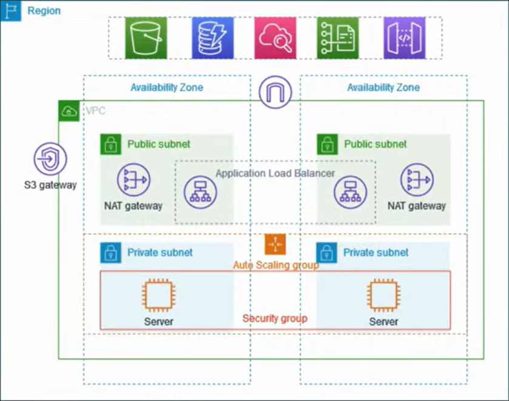

# VPC with public & private subnet

The above example shows how to create a **production-grade VPC** for running apps.

## Steps: 

- Create a VPC with NAT Gateway per region.
- Create an autoscaling group in private subnet (Needs launch template first)
- Create a bastion host with public subnet
- Copy the pem key in the bastion host to access the instances in private subnet
- Run a html pages using python3 -m http.server 8000 in both the instances in private subnet.
- Make sure port 8000 is open everywhere in the security groups.
- Create an ALB in a public subnet and try to access it using the DNS name <DNS name>:<listener port>. (Needs a target group first)

## Inbound flow

- IGW ----> ALB ---->  Target group routing ----> Autoscaling group instances (2 AZ)

## Outbound traffic flow

- Autoscaling group instances (Private subnet) ----> NAT Gateway(Public subet) ----> internet

NAT Gateway purpose here: The NAT Gateway masks the private instance's internal IP address with its own **Elastic IP (EIP)**

# Explanation 1

To improve **resiliency**, servers are deployed across **two Availability Zones** using:
- an **Auto Scaling Group**
- an **Application Load Balancer**

For **additional security**, the servers are placed in **private subnets**.  
All incoming requests reach the servers **only through the load balancer**.

The servers do **not** have direct internet access.  
For outbound internet connectivity, they use a **NAT Gateway**.

To further improve **resiliency**, a **NAT Gateway is deployed in each Availability Zone**.

# Explanation 2

The VPC contains **public subnets** and **private subnets** across **two Availability Zones**.

Each **public subnet** includes:
- a **NAT Gateway**
- a **Application load balancer**

The application servers run in the **private subnets**.  
They are **launched and terminated by an Auto Scaling Group** and receive traffic **only from the load balancer**.

The servers access the internet for outbound traffic **through the NAT Gateway**.

# Components

- Auto Scaling Group (ASG): Instead of manually creating instances, an ASG is used to maintain a desired capacity of replicas. It can automatically scale the number of servers up or down based on traffic demands. **Needs a launch template first hand.**

- Application Load Balancer (ALB): Acting as a layer 7 load balancer, the ALB resides in the public subnet and balances incoming HTTP traffic across the EC2 instances in the private subnets. **Needs a target group first hand.**

- Bastion Host (Jump Host): Because the application instances lack public IP addresses, they cannot be accessed directly via SSH. A Bastion host is created in the public subnet to act as a mediator, allowing secure SSH access into the private subnet for administration and auditing.

