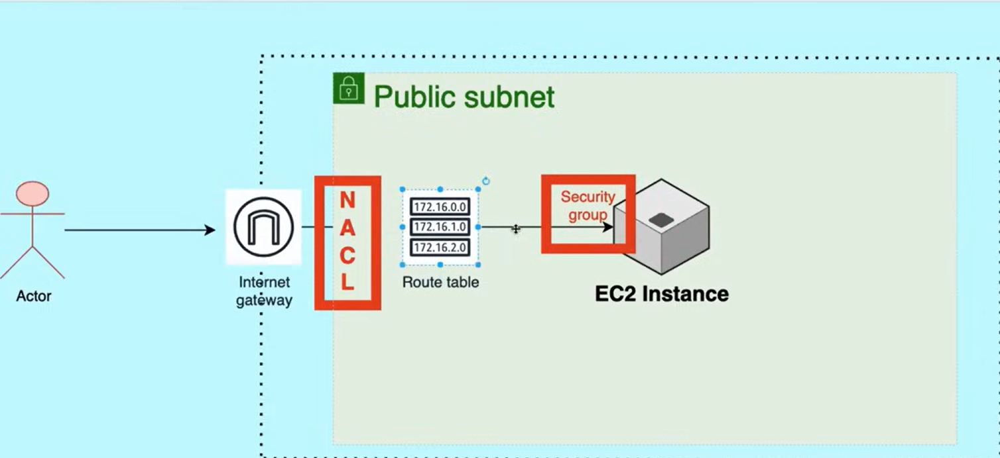

## Security Groups vs. Network ACLs (NACLs)

### 🔐 Security Groups (SG)

- **Level**:  
  Operate at the **instance level** (e.g., individual EC2 instances).

- **Rules**:  
  - Support **only “allow” rules**  
  - **No explicit deny** rules

- **Statefulness**:  
  - **Stateful** — return traffic is automatically allowed

- **Default Behavior**:  
  - **Inbound**: Deny all traffic by default  
  - **Outbound**: Allow all traffic by default  
    - **Exception**: Port **25 (SMTP)** is blocked by AWS to prevent spam

---

### 🌐 Network Access Control Lists (NACLs)

- **Level**:  
  Operate at the **subnet level**, affecting **all instances** in the subnet.

- **Rules**:  
  - Support both **“allow” and “deny”** rules

- **Statefulness**:  
  - **Stateless** — return traffic must be explicitly allowed

- **Rule Priority**:  
  - Rules are evaluated in **ascending numerical order**  
  - The **lowest rule number** is evaluated first  
  - Evaluation stops at the **first matching rule**

---

### 🆚 Quick Comparison

| Feature            | Security Group | NACL |
|--------------------|---------------|------|
| Scope              | Instance       | Subnet |
| Allow rules        | ✅ Yes         | ✅ Yes |
| Deny rules         | ❌ No          | ✅ Yes |
| Stateful           | ✅ Yes         | ❌ No |
| Rule order         | No order       | Ordered (numbered) |

# Deploying an app in a public subnet of a VPC

# What Gets Created in a VPC (2 Public + 2 Private Subnets)

---

## 🏗️ Core Networking

- **VPC**
  - CIDR block (e.g. `10.0.0.0/16`)

- **Route Tables**
  - 1 **Public Route Table**
  - 1 **Private Route Table**  
    - Sometimes **2 private route tables** (one per AZ)

---

## 🌐 Subnets (Usually Across 2 AZs)

| Subnet Type       | AZ   | Example CIDR |
|------------------|------|--------------|
| Public Subnet 1  | AZ-A | 10.0.1.0/24  |
| Public Subnet 2  | AZ-B | 10.0.2.0/24  |
| Private Subnet 1 | AZ-A | 10.0.3.0/24  |
| Private Subnet 2 | AZ-B | 10.0.4.0/24  |

---

## 🚪 Internet Access Components

### Internet Gateway (IGW)
- Attached to the **VPC**
- Enables **internet access** for public subnets

### NAT Gateway
- Created in **one public subnet**
- Assigned an **Elastic IP**
- Enables **outbound internet access** for private subnets

---

## 🛣️ Route Tables & Routes

### Public Route Table
- Associated with **both public subnets**
- Routes:
  - `10.0.0.0/16 → local`
  - `0.0.0.0/0 → Internet Gateway`

### Private Route Table
- Associated with **private subnets**
- Routes:
  - `10.0.0.0/16 → local`
  - `0.0.0.0/0 → NAT Gateway`

---

## 🔐 Security

### Security Groups
- **Default Security Group** (created with the VPC)
- Custom Security Groups for:
  - Public-facing resources (ALB, Bastion)
  - Private resources (EC2, RDS)

### Network ACLs (NACLs)
- **Default NACL**
  - Allows all inbound and outbound traffic
- Optional:
  - Custom NACLs for public and private subnets

---

## 📛 Other Default Components

- **Main Route Table**
  - Often replaced by custom public/private route tables
- **Default DHCP Options Set**
  - DNS resolution enabled
  - AmazonProvidedDNS
- **Default Network ACL**
- **Default Security Group**

---

## 🧠 Typical Resource Placement

| Resource                  | Subnet  |
|---------------------------|---------|
| Application Load Balancer | Public  |
| Bastion Host              | Public  |
| EC2 App Servers           | Private |
| RDS / ElastiCache         | Private |

---

## ⚠️ Important Notes (Interview Gold ⭐)

- Public subnet = **route to IGW**, not “public” by name
- Private subnet = **no direct route to IGW**
- NAT Gateway **must be in a public subnet**
- High availability best practice:
  - **1 NAT Gateway per AZ**
